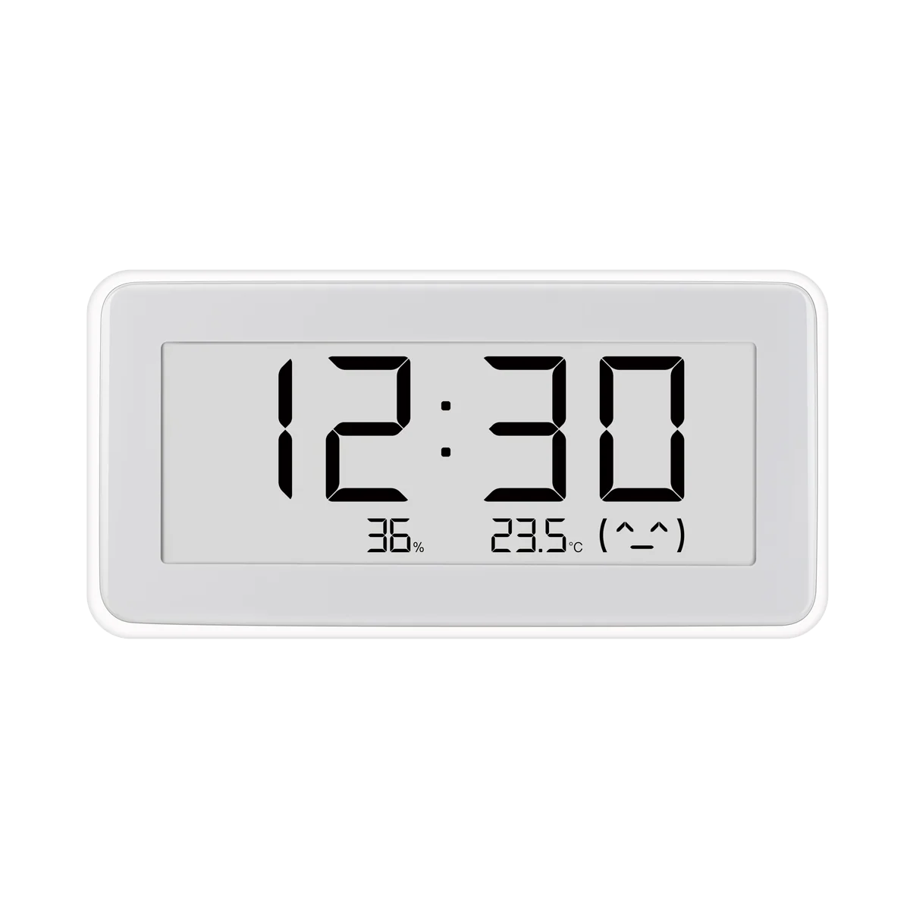

# LYWSD02 Clock Sync



Sync time and read temperature/humidity from Xiaomi LYWSD02 (LYWSD02MMC) BLE thermometer clocks.

Two methods — pick whichever suits you.

---

## Method 1: Web app (browser)

Use it directly in a Chromium-based browser. No install needed.

**Live page:** [stefan-bc.github.io/Xiaomi-LYWSD02-Clock-sync](https://stefan-bc.github.io/Xiaomi-LYWSD02-Clock-sync/)

### How it works

1. Open the page in **Chrome, Edge, or Opera** (Web Bluetooth is not supported in Firefox/Safari)
2. Click **Add device** — Chrome will show a Bluetooth picker, select your clock
3. The clock's time is synced and its temperature/humidity is read
4. For subsequent syncs, click **Sync all** — it reconnects to all previously paired clocks without the picker

### Requirements

- Chromium-based browser
- `chrome://flags/#enable-web-bluetooth-new-permissions-backend` set to **Enabled** (needed for "Sync all" to remember devices)

### Limitations

- Each clock must be paired once via the picker (browser security requirement)
- Device IDs are browser-specific — pairing doesn't carry across browsers or profiles

---

## Method 2: CLI tool (terminal)

Runs from terminal on macOS or Linux. Auto-discovers all LYWSD02 clocks in BLE range — no pairing needed. Just run it.

### Setup (one time)

```
pip3 install bleak
```

### Sync all clocks

```
curl -sL https://raw.githubusercontent.com/stefan-bc/Xiaomi-LYWSD02-Clock-sync/main/sync.py | python3
```

This downloads the latest script from GitHub and runs it. Output:

```
  LYWSD02 Sync  14:30

  Scanning...
  ✓ LYWSD02MMC  21.6°C  53%
  ✓ LYWSD02MMC  21.2°C  59%
  ✗ LYWSD02MMC

  2/3  (1 failed)
```

### Scan only (list nearby clocks)

```
curl -sL https://raw.githubusercontent.com/stefan-bc/Xiaomi-LYWSD02-Clock-sync/main/sync.py | python3 - --scan
```

### Troubleshooting

If you get **"Bluetooth device is turned off"** on macOS:
- System Settings → Privacy & Security → Bluetooth → enable **Terminal** (or your terminal app)

---

## BLE protocol reference

| Characteristic | UUID | Format |
|---|---|---|
| Time service | `ebe0ccb0-7a0a-4b0c-8a1a-6ff2997da3a6` | — |
| Time write | `ebe0ccb7-7a0a-4b0c-8a1a-6ff2997da3a6` | 5 bytes: uint32 LE unix timestamp + int8 TZ offset hours |
| Unit write | `ebe0ccbe-7a0a-4b0c-8a1a-6ff2997da3a6` | 1 byte: 0 = °C, 1 = °F |
| Temp/humidity | `ebe0ccc1-7a0a-4b0c-8a1a-6ff2997da3a6` | Notification: int16 LE temp (÷100) + uint8 humidity % |

## Credits

Based on the [lywsd02](https://github.com/h4/lywsd02) Python client.

- [Harold De Armas](https://github.com/dearmash) — C/F unit support
- [Mitja Pugelj](https://www.linkedin.com/in/mitjapugelj)
